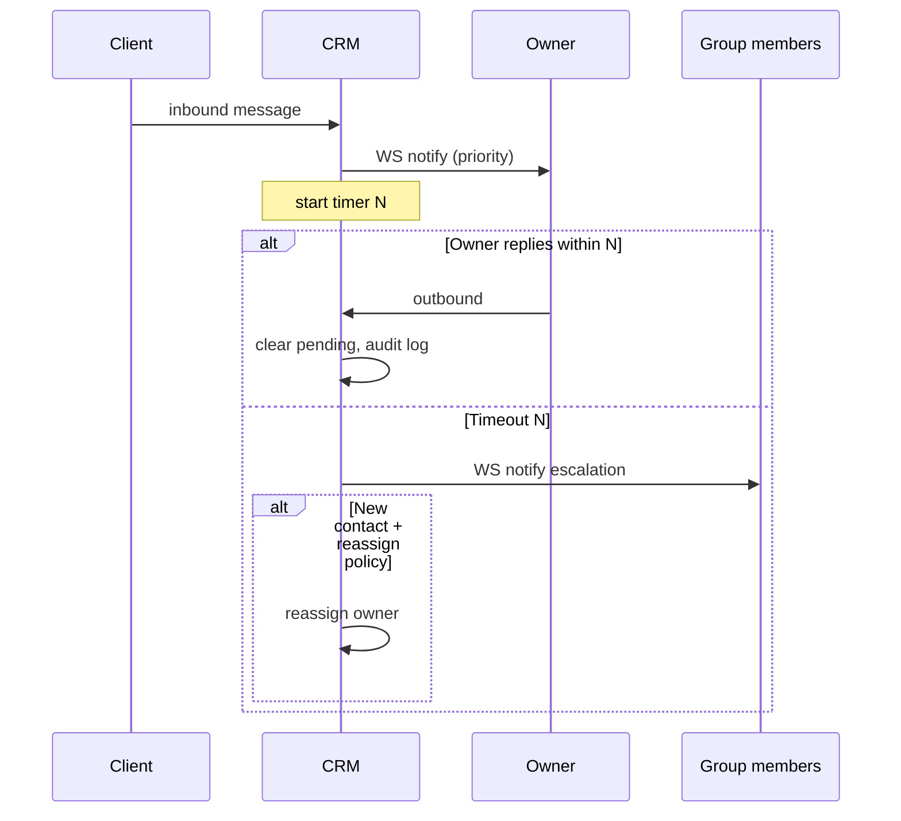

# Владение карточкой контакта (Contact Ownership)

> **Источник истины** по продуктовой логике «карточка у оператора, чат — общий ресурс группы».
> Реализация: `DATABASE.md` (схема), `API_CONTRACT.md` (эндпоинты), `ARCHITECTURE.md` (потоки).
> Матрица прав: `RBAC_MATRIX.md`. Аудит рефакторинга: `AUDIT_REFACTOR_OWNERSHIP.md`.

---

## 1. Ключевые принципы

| # | Правило |
|---|---------|
| 1 | **Владелец — не чат, а закрепление контакта внутри группы** (`contact_group_assignments`). |
| 2 | Один человек (`telegram_user_id`) → **одна глобальная карточка** `contacts`, но **отдельное владение в каждой группе**, если пишет в разные боты разных групп. |
| 3 | **Чат** = переписка `(contact_id, bot_id)`. Группа чата определяется через `bots.owner_type='group'` + `bots.owner_id`. |
| 4 | **Любой user своей группы** может **читать и писать** в чатах этой группы. В UI приоритет у **владельца карточки** (бейдж, уведомления). |
| 5 | **Передача** меняет владельца **только в рамках одной группы**. Другие группы / боты того же контакта **не затрагиваются**. |
| 6 | Межгрупповая «передача» = **добавить user в целевую группу** (оргструктура), не transfer API. |
| 7 | **Эскалация**: сначала уведомление **владельцу**; если нет ответа за **N минут** (настраивает senior) → уведомление **всей группе**; для **нового** клиента — **перераспределение** владельца. |
| 8 | Каждый **исходящий** ответ фиксируется с **владельцем карточки на момент отправки** и **фактическим автором** (обязательный аудит). |

---

## 2. Модель данных (смысл)

### 2.1 Глобальная карточка — `contacts`

Общие поля клиента: имя, телефон, email, `telegram_user_id`, `custom_fields`, история полей.
**Не хранит** единственного «владельца на всю CRM» для операционной работы — владение **по группам**.

> Колонки `contacts.assigned_user_id` / `assigned_group_id` удалены (`0025`); канон — `contact_group_assignments`. Фильтр `assigned_user_id` на `GET /contacts` — по `owner_user_id` в assignments.

### 2.2 Владение в группе — `contact_group_assignments`

| Поле | Описание |
|------|----------|
| `contact_id` | FK contacts |
| `group_id` | FK groups — **scope владения** |
| `owner_user_id` | FK users — текущий владелец карточки **в этой группе** |
| `assigned_at` | когда назначен текущий владелец |
| `assignment_source` | `auto_round_robin` \| `auto_first_responder` \| `auto_random_available` \| `manual_transfer` \| `senior_assign` |
| `last_owner_response_at` | последний исходящий от **владельца** в любом чате этой группы |
| `pending_inbound_at` | время последнего входящего, ожидающего ответа владельца (для таймера N) |
| `escalated_to_group_at` | когда сработала эскалация «вся группа» |

**Уникальность:** `UNIQUE(contact_id, group_id)`.

При первом входящем в бота группы G:
1. Создать/найти `contacts` по `telegram_user_id`.
2. Создать/найти `chats(contact_id, bot_id)`.
3. Создать/обновить `contact_group_assignments(contact_id, group_id=G)` — если нет владельца → **auto assign**.

### 2.3 Чат — `chats`

| Поле | Назначение (новая модель) |
|------|---------------------------|
| `contact_id`, `bot_id` | Идентичность переписки |
| `assigned_group_id` | Денормализация: группа бота (для индексов и scope) |
| `current_user_id` | **Deprecated → `last_handled_by_user_id`** (кто последний писал/открыл, **не** владелец) |
| `takeover_user_id` | Без изменений (senior перехват) |

Видимость и право писать определяются **группой чата**, не `current_user_id`.

### 2.4 Передача карточки — `contact_group_transfers`

Аналог `chat_transfers`, но сущность = **(contact_id, group_id)**.

При `state='accepted'`:
- `contact_group_assignments.owner_user_id` = новый владелец;
- **Все чаты** контакта, у которых `bots.owner_id = group_id` (и `owner_type='group'`), **наследуют** того же владельца в UI (бейдж на карточке);
- `chats.current_user_id` **не используется** для прав доступа.

Flow согласований — как в `TECH_SPEC.md` §5.4 (senior approve + recipient accept), но объект — **карточка в группе**, не чат.

### 2.5 Настройки эскалации — `group_escalation_settings`

| Поле | Описание |
|------|----------|
| `group_id` | PK / UNIQUE |
| `first_response_timeout_minutes` | **N** — нет ответа владельца → эскалация группе |
| `new_contact_reassign_strategy` | `first_responder` \| `random_available` |
| `notify_owner_on_inbound` | bool, default true |
| `notify_group_on_escalation` | bool, default true |

Редактирует **senior** отдела (группа принадлежит отделу). Admin — override.

### 2.6 Аудит ответов — `message_reply_audit`

На каждое исходящее `messages` (direction=`out`):

| Поле | Описание |
|------|----------|
| `message_id` | FK messages |
| `chat_id` | FK chats |
| `contact_id` | FK contacts |
| `group_id` | FK groups |
| `card_owner_user_id` | владелец `contact_group_assignments` **на момент отправки** |
| `author_user_id` | кто реально нажал «Отправить» |
| `is_on_behalf` | `author_user_id != card_owner_user_id` |
| `created_at` | timestamp |

Дублировать краткую запись в `audit_log` (`action=message.replied`, payload с owner/author).

**UI:** в ленте сообщения бейдж «Ответил: Борис (карточка: Аня)» если `is_on_behalf`.

---

## 3. Сценарии (простым языком)

### 3.1 Новый клиент пишет в бот группы «Продажи»

1. CRM создаёт карточку Марины и чат в боте.
2. В `contact_group_assignments(Марина, Продажи)` назначается, например, **Аня** (round-robin среди available).
3. **Аня** получает push/WS «новая карточка».
4. **Борис и Вика** тоже **видят** чат в разделе «Группа», но бейдж «Владелец: Аня».

### 3.2 Аня в отъезде, Марина пишет снова

1. Таймер: с момента входящего **N минут** без исходящего от **Ани** (владельца).
2. До N: уведомления только **Ане**.
3. После N: WS «нужен ответ» → **вся группа**; в списке чат подсвечен «просрочен ответ владельца».
4. **Борис** отвечает → в аудите: автор **Борис**, владелец карточки **Аня**, `is_on_behalf=true`.

### 3.3 Новый клиент, владелец молчит дольше N

1. После N без ответа **владельца** система **меняет владельца**:
   - **`first_responder`**: кто первым отправил исходящее → становится владельцем;
   - **`random_available`**: случайный `available` user группы (не offline, не `do_not_assign`).
2. `assignment_source` обновляется; событие `contact.ownership.reassigned`.

### 3.4 Передача карточки Аня → Борис (та же группа)

1. Аня или senior инициирует transfer **карточки Марины в группе Продажи**.
2. Senior approve (если инициатор user) → Борис accept.
3. `owner_user_id` = Борис **только** для `(Марина, Продажи)`.
4. Если у Марины есть чат в **другом боте / другой группе** — там владелец **не меняется**.

### 3.5 Один клиент — два бота — две группы

| Бот | Группа | Владелец карточки | Кто общается |
|-----|--------|-------------------|--------------|
| bot_sales | Продажи | Аня | Аня + коллеги из Продаж |
| bot_support | Поддержка | Игорь | Игорь + коллеги из Поддержки |

Карточка **одна** (общие поля), вкладки «Чаты по группам» в UI.

---

## 4. Уведомления (порядок)

---

## 5. RBAC (кратко)

| Действие | user | senior | admin |
|----------|------|--------|-------|
| Видеть чаты своей группы | ✅ все чаты группы | ✅ отдел | ✅ все |
| Писать в чат группы | ✅ | ✅ | ✅ |
| Редактировать карточку | ⚠️ если виден контакт | ⚠️ отдел | ✅ |
| Инициировать transfer карточки (в группе) | ✅ → member группы | ✅ в отделе | ✅ |
| Настроить N минут эскалации | ❌ | ✅ своих групп | ✅ |
| Takeover чата | ❌ | ✅ отдел | ✅ |

Подробно — `RBAC_MATRIX.md` §3.5–3.6.

---

## 6. События (WebSocket / internal)

| Topic | Кому |
|-------|------|
| `contact.ownership.assigned` | owner, group (info) |
| `contact.ownership.transferred` | old_owner, new_owner, senior |
| `contact.escalation.group_notify` | all group users |
| `contact.ownership.reassigned` | old_owner, new_owner, group |
| `message.replied.on_behalf` | owner (если не автор), senior (опц.) |

Полный каталог — `EVENTS.md`.

---

## 7. Миграция с chat-centric модели

См. `AUDIT_REFACTOR_OWNERSHIP.md`:
- что уже в коде (Round 4);
- что помечено deprecated;
- порядок миграций Alembic `0012+`.

**Не ломать** существующие `chat_transfers` до миграции данных: dual-write период или one-shot SQL backfill из `chats.assigned_user_id` → `contact_group_assignments`.

---

## 8. Слабые места

1. **Конкуренция first_responder vs random** — при одновременных ответах двух операторов нужен `SELECT FOR UPDATE` на assignment.
2. **Таймер N** — требует ARQ/Celery периодики или Redis keyspace notifications; без воркера эскалация не сработает.
3. **Карточка видна в двух группах** — UI не должен показывать владельца/чаты чужой группы (scope по `group_id`).
4. **Takeover vs on_behalf** — takeover блокирует user; on_behalf — разрешён. Не путать в UX.
5. **Объём audit** — каждое исходящее = строка; партиционирование через 6–12 месяцев.
